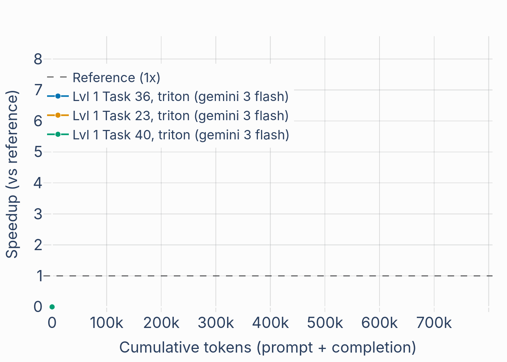
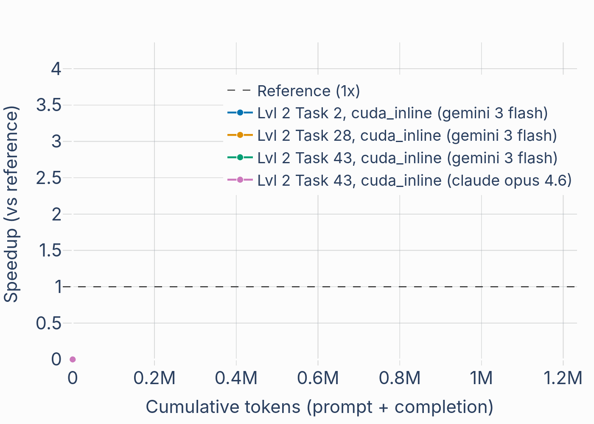

<div align="center">
  
</div>

**Evolutionary generation of efficient GPU kernels** using [GigaEvo](https://github.com/KhrulkovV/gigaevo-core-internal).  
Define a task, run evolution with an LLM backend, extract and compare optimized programs.

<div align="center">
  
  
</div>


## Features

- **Custom tasks** — Define your own kernel tasks in KernelBench format and evolve them.
- **KernelBench integration** — Use existing [KernelBench](https://github.com/ScalingIntelligence/KernelBench) problems.
- **Triton and CUDA inline backends** - two most popular ways to create kernels, suitable for different scenarious.
- **Remote or local execution** — Run validation locally or via a remote eval server.
- **Cost efficient** - works with fast models **gemini flash 3** and **gpt-oss-120b**. Current experiments costs **0.5-1$**. 
Frontier models with high reasoning effort would be benefitial, yet cost would be magnitude higher.
---

## Requirements

- **Python** >= 3.12
- **LLM API** — OpenAI-compatible (e.g. [OpenRouter](https://openrouter.ai), or a local server like SGLang).  
- **Redis** — Used by GigaEvo for experiment state.

---

## Installation

### From source

```bash
git clone https://github.com/AXXX-Institute/kernel-evo.git
cd kernel-evo
pip install -e . --ignore-requires-python
```

> **Note:** `--ignore-requires-python` relaxes the Python version check (KernelBench may declare 3.10 but works on 3.12).  
> For custom branches of `gigaevo` or `kernelbench`, edit the Git URLs in `pyproject.toml`.

### Docker

Pull and run (when a pre-built image is published):

```bash
docker pull sivtsovdt/kernel-evo:latest
docker run --rm sivtsovdt/kernel-evo:latest kernel-evo --help
```

To build the image yourself (e.g. for private dependencies or development), see **[build/README.md](build/README.md)**.

---

## Custom kernel task

To evolve your own kernel, create a task in **KernelBench format**. Example layout:

```
tasks/
└── armt_associate/
    └── task.py
```

See `tasks/armt_associate` in this repo for a reference. You can also use any existing task from [KernelBench](https://github.com/ScalingIntelligence/KernelBench).

---

## Run evolution

Evolution can use a **local** or **remote** LLM (e.g. SGLang, OpenRouter). Examples below use OpenRouter and a remote eval server.

### 1. Start the eval server (optional, for remote validation)

In a separate terminal:

```bash
kernel-evo eval-server --port 15000
```

### 2. Evolve with a custom task

```bash
OPENAI_API_KEY="sk-or-v1-..." kernel-evo evolve \
  --problem-path tasks/armt_associate/task.py \
  --experiment-name custom_associate \
  --backend triton \
  --precision fp16 \
  --model-name <MODEL> \
  --llm-base-url https://openrouter.ai/api/v1 \
  --redis-db 0 \
  --max-generations 400 \
  --max-mutations-per-generation 4 \
  --validator-debug \
  --log-dir <dir_for_logs> \
  --execution-mode remote_execution
```

### 3. Evolve with a KernelBench task

```bash
OPENAI_API_KEY="<KEY>" kernel-evo evolve \
  --level 1 \
  --problem-id 36 \
  --experiment-name kb_level1_36 \
  --dataset-src huggingface \
  --dataset-name ScalingIntelligence/KernelBench \
  --backend triton \
  --precision fp16 \
  --model-name <MODEL> \
  --llm-base-url https://openrouter.ai/api/v1 \
  --redis-db 0 \
  --max-generations 400 \
  --max-mutations-per-generation 4 \
  --validator-debug \
  --log-dir <dir_for_logs> \
  --execution-mode remote_execution
```

---

## Monitor progress

```bash
cd gigaevo/outputs/<DATE>/<EXPERIMENT_START>
tensorboard --logdir .
```

Use TensorBoard to find iterations with good performance before extracting programs.

---

## Extract a program

Export the program from a specific iteration (e.g. after inspecting TensorBoard):

```bash
kernel-evo extract \
  --redis-db 0 \
  --iteration 8 \
  --redis-prefix "kernel_evo" \
  --output-file best_program.py
```

---

## Compare two programs

### Custom task

```bash
kernel-evo compare \
  --program-a prog_a.py \
  --program-b prog_b.py \
  --problem-path tasks/armt_associate/task.py \
  --backend triton \
  --precision fp16 \
  --num-perf-trials 200 \
  --num-correct-trials 20
```

### KernelBench task

```bash
kernel-evo compare \
  --program-a prog_a.py \
  --program-b prog_b.py \
  --dataset-src huggingface \
  --dataset-name ScalingIntelligence/KernelBench \
  --level 1 \
  --problem-id 36 \
  --backend triton \
  --precision fp16 \
  --num-perf-trials 200 \
  --num-correct-trials 20
```

---

## CLI overview

| Command         | Description                          |
|----------------|--------------------------------------|
| `evolve`       | Run evolution (custom or KernelBench) |
| `eval-server`  | Start remote validation server       |
| `extract`      | Export program by iteration from Redis |
| `compare`      | Compare two programs (correctness + perf) |

---

## Best practices


### Model selection

Evolution deeply depends on underlying model. 
For better results, one should use frontier models, like gpt, claude or gemini. 

Recomendation for best value vendor model:
1. **gemini flash 3**. Capable, yet not very costly. It creates faulty kernels, but able to recover buggy code.

Recomendation for opensource models:
1. **gpt-oss-120b** - best baseline for kernel evolution. Good enough reasoning to recover faulty kernels.
2. **GLM-5**. From all very large open llms, only one seems like knowing triton and generate decent kernels. Downside - slower on generation and very large for local inference.

### Experiments

Quality of result depends on starting seeds and can vary from different run. So make sense to restart and try again if solution is very bad during first 200k tokens.

Also, we notised what triton is better on small efficient kernels, like softmax and matmuls. Just because it recuires less knowledge from model. For complex tasks like KernelBench level 2 difference is lower. 

### Remote validation

Better to run validation via validator server in different terminal. This way, one can see results.

### Cheaper start

Use flag `--disable-insights-lineage` with `kernel-evo evolve` to disable addtitional calls. Benefitial for short debug runs or with expensive models.
